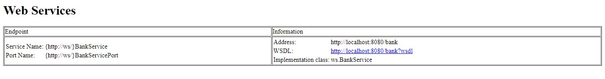
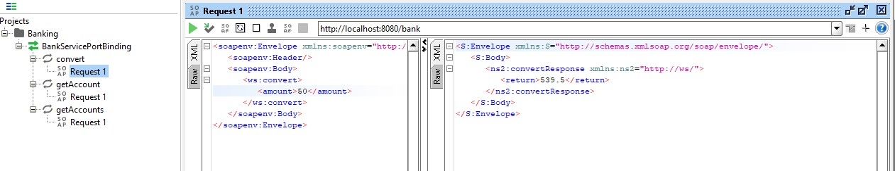
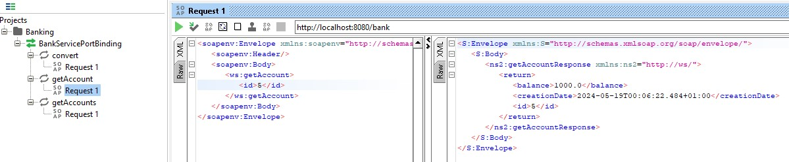
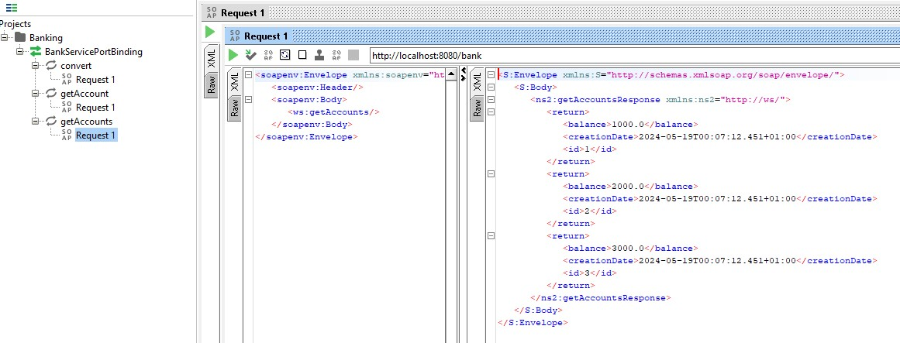
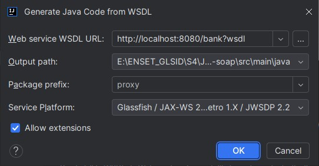

# Activité Pratique: Web services SOAP

## Objectif

1. Créer un Web service qui permet de : • Convertir un montant de l’euro en DH
   • Consulter un Compte
   • Consulter une Liste de comptes
2. Déployer le Web service avec un simple Serveur JaxWS
3. Consulter et analyser le WSDL avec un Browser HTTP
4. Tester les opérations du web service avec un outil comme SoapUI ou Oxygen
5. Créer un Client SOAP Java
    - Générer le Stub à partir du WSDL
    - Créer un client SOAP pour le web service

## Réalisation

### 1. Création du Web service

On a creé une classe `BanqueService` qui contient les méthodes suivantes:

- `convert(double montant)`: qui permet de convertir un montant de l’euro en DH
- `getAccount(int id)`: qui permet de consulter un Compte
- `getAccounts()`: qui permet de consulter une Liste de comptes

Puis, on a utilisé l'annotation `@WebService` pour déclarer la classe comme un Web service et l'annotation `@WebMethod`
pour déclarer les méthodes comme des opérations du Web service.

**Dépendances Maven :**

```xml

<dependency>
    <groupId>com.sun.xml.ws</groupId>
    <artifactId>jaxws-ri</artifactId>
    <version>4.0.2</version>
    <type>pom</type>
</dependency>
```

**Code de la classe `BanqueService`:**

```java

@WebService(serviceName = "BankService")
public class BankService {
    @WebMethod(operationName = "convert")
    public double convert(@WebParam(name = "amount") double amount) {
        return amount * 10.79;
    }

    @WebMethod(operationName = "getAccount")
    public Account getAccount(@WebParam(name = "id") int id) {
        Account account = new Account();
        account.setId(id);
        account.setBalance(1000);
        account.setCreationDate(new Date());
        return account;
    }

    @WebMethod(operationName = "getAccounts")
    public List<Account> getAccounts() {
        return List.of(
                new Account(1, 1000, new Data()),
                new Account(2, 2000, new Data()),
                new Account(3, 3000, new Data())
        );
    }
}
```

### 2. Déploiement du Web service

On a créé une classe `ServerJWS` qui permet de déployer le Web service avec un simple Serveur JaxWS.

**Code de la classe `ServerJWS`:**

```java
public class ServerJWS {
    public static void main(String[] args) {
        String url = "http://localhost:8080/";
        Endpoint.publish(url + "bank", new BankService());
        System.out.println("Web service is running on " + url + "bank");
    }
}
```

Après l'exécution de la classe `ServerJWS`:

```text
BankService is published on http://localhost:8080/bank
```

### 3. Consultation et analyse du WSDL

On a consulté le WSDL du Web service en utilisant un Browser HTTP.
Lorsqu'on accède à l'URL `http://localhost:8080/bank` on trouve le tableau suivant:


Parmi les informations affichées, on trouve le lien vers le WSDL du Web service:
http://localhost:8080/bank?wsdl
Le WSDL contient les informations suivantes:

- Les opérations du Web service
- Les types de données utilisés
- Les messages échangés
- Les ports et les bindings
- Les adresses des services

Exemples de chaque partie

```xml

<wsdl:operation name="convert">
    <wsdl:input message="tns:convert"/>
    <wsdl:output message="tns:convertResponse"/>
</wsdl:operation>
```

```xml

<wsdl:message name="convert">
    <wsdl:part name="parameters" element="tns:convert"/>
</wsdl:message>
```

```xml

<wsdl:port binding="tns:BankServiceSoapBinding" name="BankServicePort">
    <soap:address location="http://localhost:8080/bank"/>
</wsdl:port>
```

### 4. Test des opérations du Web service avec SoapUI

On a testé les opérations du Web service avec l'outil SoapUI.
On a créé un nouveau projet SoapUI et on a ajouté le WSDL du Web service.
Ensuite, on a testé les opérations `convert`, `getAccount` et `getAccounts` avec des valeurs différentes.

**Test de l'opération `convert`:**


**Test de l'opération `getAccount`:**


**Test de l'opération `getAccounts`:**


### 5. Création d'un Client SOAP Java

#### Génération du Stub à partir du WSDL

[Jakarta EE: Web Services (JAX-WS)]: https://plugins.jetbrains.com/plugin/18584-jakarta-ee-web-services-jax-ws-?_ga=2.131091087.1063697870.1716075447-137925824.1678353276&_gl=1%2A1pypp69%2A_ga%2AMTM3OTI1ODI0LjE2NzgzNTMyNzY.%2A_ga_9J976DJZ68%2AMTcxNjA3NTQ0Ni4xOC4xLjE3MTYwNzU3MDguNTAuMC4w
Dans intelliJ IDEA, le plugin JAX-WS permet de générer le Stub à partir du WSDL.

On ouvre l'outil: Tools | XML WebServices and WSDL | Generate Java Code From WSDL

On choisit le WSDL du Web service et on spécifie le package de destination.



#### Création d'un client SOAP pour le Web service

On a créé une classe `ClientJWS` qui permet de tester les opérations du Web service.

**Code de la classe `ClientJWS`:**

```java
public class ClientJWS {
    public static void main(String[] args) {
        BankService proxy = new BankWS().getBankServicePort();
        System.out.println("convert(1000) = " + proxy.convert(1000));
        Account account = proxy.getAccount(1);
        printAccount(account);

        List<Account> accounts = proxy.getAccounts();
        accounts.forEach(ClientJWS::printAccount);
    }

    private static void printAccount(Account account) {
        System.out.println("Bank account:");
        System.out.println("Id " + account.getId());
        System.out.println("Balance " + account.getBalance());
        System.out.println("Creation date " + account.getCreationDate());
    }
}
```

Après l'exécution de la classe `ClientJWS`:

```text
convert(1000) = 10790.0
Bank account:
Id 1
Balance 1000.0
Creation date 2024-05-19T00:55:05.052+01:00
Bank account:
Id 1
Balance 1000.0
Creation date 2024-05-19T00:55:05.084+01:00
Bank account:
Id 2
Balance 2000.0
Creation date 2024-05-19T00:55:05.084+01:00
Bank account:
Id 3
Balance 3000.0
Creation date 2024-05-19T00:55:05.084+01:00
```